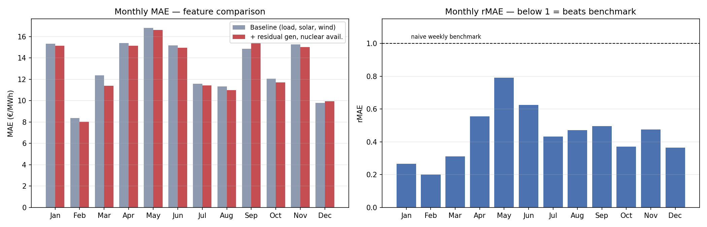

# Price-Prediction

## Motivation

Previous studies have shown that combining fundamental electricity-market
models with econometric or machine-learning approaches can improve electricity
price forecasting accuracy. In these hybrid approaches, information
derived from a fundamental dispatch model, such as the estimated market-clearing
price, is used as an additional input to a data-driven forecasting model [1-3].

Motivated by these results, this project investigates whether a price signal
derived from the EOLES dispatch model can improve day-ahead electricity price
forecasts for the French market.

## First step: LEAR Benchmark Model

As a first step, the LEAR (Lasso Estimated AutoRegressive) model is implemented
as an econometric benchmark for day-ahead electricity price forecasting[4].

The model produces the 24 hourly electricity prices for day `d` using
information that is available before delivery.

### Input features

The current implementation uses:

- Historical day-ahead electricity prices
- Day-ahead load forecast
- Day-ahead generation forecast
- Nuclear availability 
- Residual dispatchable generation forecasr
- Day-of-week information
For each forecast day `d`, historical electricity prices from:

- `d-1`
- `d-2`
- `d-3`
- `d-7`

are considered. However for the exogenous variables only lag of one day and one week are considered.

Training period: 2020-2024
Testing period: 2024- 2025

#Result of implementation of the lear and its Limitations

Full-year 2025 backtest, EPEX France day-ahead. **MAE 13.2 €/MWh**, **rMAE 0.43** vs naive weekly persistence — the model beats the benchmark in every month, but:

**Near-zero and negative prices are poorly calibrated.** France's PV penetration produces frequent midday price collapses. The model tracks their shape but overshoots their depth: 884 negative forecasts, half of them on hours that were actually positive (~11% of total error). Clipping at zero would cut MAE by 11.6% — deliberately not applied, since negative prices are the signal that matters for storage dispatch.

**sMAPE is unreliable here.** It ranges 7.5%–98.5% across months while MAE stays within 8–17 €/MWh. Near-zero denominators inflate it regardless of absolute error. Read MAE and rMAE; sMAPE is reported only for comparability with the EPF literature.

**Error is structural, not event-driven.** Removing the 30 worst days (8% of the sample) improves MAE by only 12%. Data cleaning offers little upside.

**Worst hours are 19:00, 18:00 and 08:00** — the demand peaks, i.e. the hours that matter most for trading. Headline MAE understates operationally relevant error.

**Linear specification cannot separate regimes.** LEAR fits one set of coefficients across nuclear-marginal nights, solar-marginal middays and gas-marginal peaks — the likely root cause of the two points above.

**Missing fundamentals:** nuclear availability (dominant French price driver), TTF gas, EU ETS carbon.

**Calibration window untuned:** single 3-year window; the literature recommends ensembling short (8–12 week) and long (3–4 year) windows.

## Second step: EOLES-Dispatch fundamental price signal

The "Planned" coupling with a fundamental dispatch model is now implemented: [EOLES-Dispatch](https://github.com/c-leblanc/EOLES-Dispatch), a Pyomo cost-minimization unit-commitment model, is used to compute a simulated market-clearing price (MCP) per hour, intended as an additional input feature for LEAR/LightGBM alongside the exogenous variables above.

### Motivation: look-ahead bias

EOLES-Dispatch was originally built to solve an entire year at once, with the year treated as cyclic (December 31 wraps into January 1). Solved this way, the model effectively has perfect foresight of the whole period when it decides how to run every power plant and use every reservoir on any given day — including days that, from a forecasting standpoint, haven't happened yet. A price feature computed like this cannot be reproduced in a real forecasting setting, and it risks leaking information the model should not have access to.

### Fix: rolling, non-cyclic horizon

The model was rewritten to run as a receding-horizon (MPC-style) simulation instead:

- All cyclic (year-end-wraps-to-year-start) boundary constraints were removed and replaced with genuine start-of-horizon conditions.
- The dispatch is solved in overlapping 3-day windows (buffer day, committed day, look-ahead buffer day), sliding forward one day at a time. Only the middle day's result is kept; the buffer days exist purely to give the optimizer local context and are discarded.
- Battery/reservoir state-of-charge and thermal on/off status are carried over from the window 2 days prior (the last window whose committed day is now settled), so each window starts from a real, already-decided state rather than an assumption.
- Resource constraints that used to apply to the whole year at once (total hydro reservoir drawdown, total thermal running hours) are now prorated: each window gets a ceiling equal to the remaining budget divided by the number of periods left, so a single short-sighted window cannot exhaust a whole month's water or a whole year's fuel allowance in one pass.

A cold-start bug was found and fixed during this rewrite: the very first window used to force every thermal unit to its full available capacity on hour 1 by default, which is infeasible whenever that unit's prorated ceiling is tighter than its full-capacity default. The fix leaves a unit's initial on/off state unconstrained when no real prior-window value is available, instead of inventing one. A regression test for this (`tests/test_rolling_horizon.py`) runs in CI.

### Validation (January 2019)

The rolling-horizon price series was compared against both the old full-foresight version and real EPEX France day-ahead prices for the same month (from the ENTSO-E Transparency Platform):

- The rolling version's price volatility (std. dev. **14.0 €/MWh**) closely matches real prices (**14.1 €/MWh**), while the full-foresight version is roughly half as volatile (**6.2 €/MWh**) — a perfect-information optimizer smooths out the price swings a real, foresight-limited system actually exhibits.
- Point-by-point accuracy against real prices is comparable between the two (MAE ≈ 7 €/MWh either way) — the rolling version is not "more accurate" hour-by-hour, but it is the only one that is actually deployable, since the full-foresight version requires future data unavailable at forecast time.
- The window hand-off does not introduce artificial price discontinuities: the largest hour-to-hour price jumps in the series all occur in the interior of a committed day (e.g. evening demand peaks), not at the seams between windows.

### Known limitation: hydro/thermal budget proration

The even proration of remaining hydro and thermal budgets across remaining periods is a simplification. It reliably prevents one window from draining a whole month's water or year's fuel allowance, but it also prevents legitimately concentrating resource use into a specific high-value window, since it has no notion of which future periods are actually more valuable. In practice this suppresses some of the deepest price troughs seen in the full-foresight version (extreme hydro-driven price collapses during systemwide oversupply). The correct fix is a dynamic water-value formulation (e.g. SDDP-style, calibrated from past years' data so it doesn't leak the forecast period's own future) rather than a flat equal-share ceiling; this is future work, not yet implemented.

## Planned

- Extend EOLES-Dispatch input data beyond 2019 so it overlaps with LEAR's 2020-2025 training/testing window
- Complete the full-year (2019) rolling-horizon backtest and validate it the same way as January
- Feed the validated rolling-horizon EOLES-Dispatch price series into LEAR/LightGBM as an input feature
- Replace the flat-proration hydro/thermal budget rationing with a proper water-value (SDDP-style) formulation
- Benchmark LightGBM — non-linear learner should handle regime separation
- Add nuclear availability, TTF, EU ETS
- Test calibration-window ensembling

## Second step: EOLES-Dispatch fundamental price signal

The "Planned" coupling with a fundamental dispatch model is now implemented: [EOLES-Dispatch](https://github.com/c-leblanc/EOLES-Dispatch), a Pyomo cost-minimization unit-commitment model, is used to compute a simulated market-clearing price (MCP) per hour, intended as an additional input feature for LEAR/LightGBM alongside the exogenous variables above.

### Motivation: look-ahead bias

EOLES-Dispatch was originally built to solve an entire year at once, with the year treated as cyclic (December 31 wraps into January 1). Solved this way, the model effectively has perfect foresight of the whole period when it decides how to run every power plant and use every reservoir on any given day — including days that, from a forecasting standpoint, haven't happened yet. A price feature computed like this cannot be reproduced in a real forecasting setting, and it risks leaking information the model should not have access to.

### Fix: rolling, non-cyclic horizon

The model was rewritten to run as a receding-horizon (MPC-style) simulation instead:

- All cyclic (year-end-wraps-to-year-start) boundary constraints were removed and replaced with genuine start-of-horizon conditions.
- The dispatch is solved in overlapping 3-day windows (buffer day, committed day, look-ahead buffer day), sliding forward one day at a time. Only the middle day's result is kept; the buffer days exist purely to give the optimizer local context and are discarded.
- Battery/reservoir state-of-charge and thermal on/off status are carried over from the window 2 days prior (the last window whose committed day is now settled), so each window starts from a real, already-decided state rather than an assumption.
- Resource constraints that used to apply to the whole year at once (total hydro reservoir drawdown, total thermal running hours) are now prorated: each window gets a ceiling equal to the remaining budget divided by the number of periods left, so a single short-sighted window cannot exhaust a whole month's water or a whole year's fuel allowance in one pass.

A cold-start bug was found and fixed during this rewrite: the very first window used to force every thermal unit to its full available capacity on hour 1 by default, which is infeasible whenever that unit's prorated ceiling is tighter than its full-capacity default. The fix leaves a unit's initial on/off state unconstrained when no real prior-window value is available, instead of inventing one. A regression test for this (`tests/test_rolling_horizon.py`) runs in CI.

### Validation (January 2019)

The rolling-horizon price series was compared against both the old full-foresight version and real EPEX France day-ahead prices for the same month (from the ENTSO-E Transparency Platform):

- The rolling version's price volatility (std. dev. **14.0 €/MWh**) closely matches real prices (**14.1 €/MWh**), while the full-foresight version is roughly half as volatile (**6.2 €/MWh**) — a perfect-information optimizer smooths out the price swings a real, foresight-limited system actually exhibits.
- Point-by-point accuracy against real prices is comparable between the two (MAE ≈ 7 €/MWh either way) — the rolling version is not "more accurate" hour-by-hour, but it is the only one that is actually deployable, since the full-foresight version requires future data unavailable at forecast time.
- The window hand-off does not introduce artificial price discontinuities: the largest hour-to-hour price jumps in the series all occur in the interior of a committed day (e.g. evening demand peaks), not at the seams between windows.

### Known limitation: hydro/thermal budget proration

The even proration of remaining hydro and thermal budgets across remaining periods is a simplification. It reliably prevents one window from draining a whole month's water or year's fuel allowance, but it also prevents legitimately concentrating resource use into a specific high-value window, since it has no notion of which future periods are actually more valuable. In practice this suppresses some of the deepest price troughs seen in the full-foresight version (extreme hydro-driven price collapses during systemwide oversupply). The correct fix is a dynamic water-value formulation (e.g. SDDP-style, calibrated from past years' data so it doesn't leak the forecast period's own future) rather than a flat equal-share ceiling; this is future work, not yet implemented.

[1] S. Ben Amor, T. Möbius, F. Ziel, and F. Müsgens,
"Bridging an Energy System Model with an Ensemble Deep-Learning Approach
for Electricity Price Forecasting," Preprint, 2026.
[2] R. A. de Marcos, A. Bello, and J. Reneses,
"Electricity price forecasting in the short term hybridising fundamental
and econometric modelling,"
Electric Power Systems Research, vol. 167, pp. 240–251, 2019.
doi: 10.1016/j.epsr.2018.10.034.

[3] P. Beran, A. Vogler, and C. Weber,
"Multi-Day-Ahead Electricity Price Forecasting: A Comparison of Fundamental,
Econometric and Hybrid Models," 2021.

[4] Lago, J., Marcjasz, G., De Schutter, B., & Weron, R. (2021). 
Forecasting day-ahead electricity prices: A review of state-of-the-art algorithms, 
best practices and an open-access benchmark. Applied Energy, 293, 116983.
